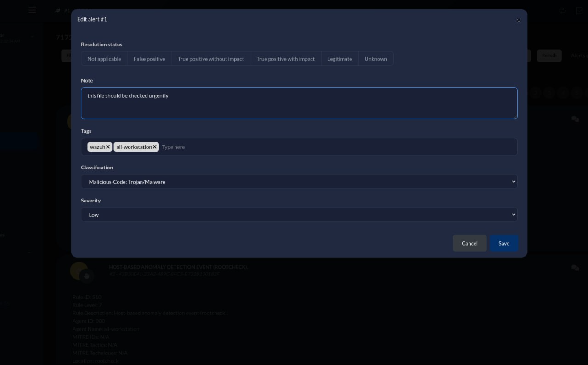

# Implementation of Security Operations Center Based on Wazuh Tool

## 1. Goal and Tasks of the Project

### Goal

- To build a fully functional Security Operations Center (SOC) using open-source tools (Wazuh (SIEM), AbusIPDB (Threat Intelligence Platform), IRIS (Ticketing System)).

- Enhance capabilities for detecting, analyzing, and responding to security incidents using SIEM, threat intelligence, and a ticketing system.

### Tasks and Responsibilities

1. **Mohamad Nour Shahin:** Infrastructure Setup.

   - Set up the virtual environment for the SOC.

   - Install and configure the Wazuh SIEM tool.

   - Document the installation and configuration process for Wazuh.

   - Create a basic incident dashboard in Wazuh for tracking events.

   - Ensure connectivity between Wazuh and other tools (e.g., AbusIPDB, IRIS).

2. **Yehia Sobeh:** Integration of AbusIPDB for threat intelligence.

   - Install and configure AbusIPDB as the threat intelligence platform.

   - Integrate AbusIPDB with Wazuh for contextual threat information.

   - Document the integration process and configuration steps.

   - Test threat intelligence data flow into Wazuh and provide sample scenarios.

   - Propose mechanisms to enrich threat data using AbusIPDB.

- **Ammar Meslmani:** Configuration of IRIS for case management and incident automation.

  - Install and configure IRIS as the ticketing system for incident tracking.

  - Link IRIS with Wazuh to automatically log security incidents.

  - Develop and test automated responses to at least two security incidents (e.g., failed login attempts, malware detection).

  - Document automation workflows and response mechanisms.

  - Simulate the incident management process for the demo.

- **Ali Hamdan:** Testing, incident simulation, and documentation.

  - Test the overall integration and functionality of the SOC setup.

  - Identify and document potential issues during integration and solutions implemented.

  - Write scripts to simulate security incidents for testing (e.g., running a vulnerability scanner, mock phishing attacks).

  - Prepare the final demo presentation and record it for submission.

  - Organize and compile the documentation from all members into a cohesive report.

---

## 2. Execution Plan and Methodology

### Plan for the Solution

1. **Setup:**
   - Deploy virtual machines or Docker containers for Wazuh, AbusIPDB, and IRIS.
   - Establish network connectivity and API integrations.
2. **Integration:**
   - Configure Wazuh to collect logs and generate alerts.
   - Integrate AbusIPDB for threat intelligence enrichment.
   - Set up IRIS for incident tracking and automation workflows.
3. **Testing:**
   - Simulate real-world security incidents (e.g., brute force attacks, malware detection).
   - Automate responses and document workflows.

### Methodology

- Follow official documentation for tool installations and configurations.
- Implement and test workflows for data flow, alert generation, and automated responses.
- Document challenges and solutions.

---

## 3. Development of Solution and Tests (Proof of Concept)

### Environment Preparation

#### Description of the SOC setup: VMs/containers, OS versions, and configurations.

1. Setup Wazuh server on Ubuntu 22.04 (Ali Device number one):

   - Download and run the Wazuh installation assistant:

     ```command
       curl -sO https://packages.wazuh.com/4.9/wazuh-install.sh && sudo bash ./wazuh-install.sh -a -o
     ```

   - Configure Wazuh, install Wazuh Indexer, install Wazuh Server, and install Wazuh Dashboard.

     

     

   - Access the Wazuh web interface with `https://10.91.56.198:443` and my credentials:

     

2. Setup Wazuh Agent on Ubuntu 20.04 (Ali Device number two):

   - Install the GPG key:

     ```command
       curl -s https://packages.wazuh.com/key/GPG-KEY-WAZUH | gpg --no-default-keyring --keyring gnupg-ring:/usr/share/keyrings/wazuh.gpg --import && chmod 644 /usr/share/keyrings/wazuh.gpg
     ```

     

   - Add the repository:

     ```command
       echo "deb [signed-by=/usr/share/keyrings/wazuh.gpg] https://packages.wazuh.com/4.x/apt/ stable main" | tee -a /etc/apt/sources.list.d/wazuh.list
     ```

     

   - Update the package information:

     ```command
       sudo apt-get update
     ```

     

   - Edit the WAZUH_MANAGER variable to contain our Wazuh manager IP address or hostname `10.91.56.198`:

     ```command
       WAZUH_MANAGER="10.91.56.198" apt-get install wazuh-agent
     ```

     

   - Enable and start the Wazuh agent service:

     ```command
       systemctl daemon-reload
       systemctl enable wazuh-agent
       systemctl start wazuh-agent
     ```

     

3. Setup IRIS on Ubuntu 22.04 (Ammar Device):

   - Setup Docker on the device:

     

   - Intalling the IRIS on the device:

     

   - After Installing, Access the web interface:

     

   - Login and see the Dashboard of IRIS:

     

<!-- - Network architecture with diagrams showing relationships between components. -->
<!-- https://nateuribe.tech/blog/foss-soc/ -->

### Working Instances of Tools

- **Wazuh:** Configured to collect logs, generate alerts, and display dashboards.

  here you can see the connection between the Wazuh Server and Wazuh Agent:

  

- **AbusIPDB:** Integrated with Wazuh for threat intelligence enrichment.

  - First I registered in AbusIPDB and creat a API key.

  - Then we follow this [documentaion](https://wazuh.com/blog/detecting-known-bad-actors-with-wazuh-and-abuseipdb/) to configure wazuh to send request to check if an IP address is exist as a malicous.

  **steps**

  1. We add rules into var/ossec/etc/rules/local_rules.xml for
     trigger alert when using public ip and rules to accept the answer from AbusIPDB
     but we do it from the dashboard
     

  2. we creat the custom-abuseipdb.py in ` /var/ossec/integrations/custom-abuseipdb.py`
     

  ```
  #!/var/ossec/framework/python/bin/python3
  # Copyright (C) 2015-2022, Wazuh Inc.

  import json
  import sys
  import time
  import os
  from socket import socket, AF_UNIX, SOCK_DGRAM

  try:
      import requests
      from requests.auth import HTTPBasicAuth
  except Exception as e:
      print("No module 'requests' found. Install: pip install requests")
      sys.exit(1)

  # Global vars

  debug_enabled = False
  pwd = os.path.dirname(os.path.dirname(os.path.realpath(__file__)))
  json_alert = {}
  now = time.strftime("%a %b %d %H:%M:%S %Z %Y")

  # Set paths
  log_file = '{0}/logs/integrations.log'.format(pwd)
  socket_addr = '{0}/queue/sockets/queue'.format(pwd)

  def main(args):
      debug("# Starting")

      # Read args
      alert_file_location = args[1]
      apikey = args[2]

      debug("# API Key")
      debug(apikey)

      debug("# File location")
      debug(alert_file_location)

      # Load alert. Parse JSON object.
      with open(alert_file_location) as alert_file:
          json_alert = json.load(alert_file)
      debug("# Processing alert")
      debug(json_alert)

      # Request AbuseIPDB info
      msg = request_abuseipdb_info(json_alert,apikey)

      # If positive match, send event to Wazuh Manager
      if msg:
          send_event(msg, json_alert["agent"])

  def debug(msg):
      if debug_enabled:
          msg = "{0}: {1}\n".format(now, msg)

          print(msg)

          f = open(log_file,"a")
          f.write(msg)
          f.close()

  def collect(data):
    abuse_confidence_score = data['abuseConfidenceScore']
    country_code = data['countryCode']
    usage_type = data['usageType']
    isp = data['isp']
    domain = data['domain']
    total_reports = data['totalReports']
    last_reported_at = data['lastReportedAt']
    return abuse_confidence_score, country_code, usage_type, isp, domain, total_reports, last_reported_at

  def in_database(data, srcip):
    result = data['totalReports']
    if result == 0:
      return False
    return True

  def query_api(srcip, apikey):
    params = {'maxAgeInDays': '90', 'ipAddress': srcip,}
    headers = {
    "Accept-Encoding": "gzip, deflate",
    'Accept': 'application/json',
    "Key": apikey
    }
    response = requests.get('https://api.abuseipdb.com/api/v2/check',params=params, headers=headers)
    if response.status_code == 200:
        json_response = response.json()
        data = json_response["data"]
        return data
    else:
        alert_output = {}
        alert_output["abuseipdb"] = {}
        alert_output["integration"] = "custom-abuseipdb"
        json_response = response.json()
        debug("# Error: The AbuseIPDB encountered an error")
        alert_output["abuseipdb"]["error"] = response.status_code
        alert_output["abuseipdb"]["description"] = json_response["errors"][0]["detail"]
        send_event(alert_output)
        exit(0)

  def request_abuseipdb_info(alert, apikey):
      alert_output = {}
      # If there is no source ip address present in the alert. Exit.
      if not "srcip" in alert["data"]:

        return(0)

      # Request info using AbuseIPDB API
      data = query_api(alert["data"]["srcip"], apikey)

      # Create alert
      alert_output["abuseipdb"] = {}
      alert_output["integration"] = "custom-abuseipdb"
      alert_output["abuseipdb"]["found"] = 0
      alert_output["abuseipdb"]["source"] = {}
      alert_output["abuseipdb"]["source"]["alert_id"] = alert["id"]
      alert_output["abuseipdb"]["source"]["rule"] = alert["rule"]["id"]
      alert_output["abuseipdb"]["source"]["description"] = alert["rule"]["description"]
      alert_output["abuseipdb"]["source"]["full_log"] = alert["full_log"]
      alert_output["abuseipdb"]["source"]["srcip"] = alert["data"]["srcip"]
      srcip = alert["data"]["srcip"]
      # Check if AbuseIPDB has any info about the srcip
      if in_database(data, srcip):
        alert_output["abuseipdb"]["found"] = 1

      # Info about the IP found in AbuseIPDB
      if alert_output["abuseipdb"]["found"] == 1:
          abuse_confidence_score, country_code, usage_type, isp, domain, total_reports, last_reported_at = collect(data)


          # Populate JSON Output object with AbuseIPDB request
          alert_output["abuseipdb"]["abuse_confidence_score"] = abuse_confidence_score
          alert_output["abuseipdb"]["country_code"] = country_code
          alert_output["abuseipdb"]["usage_type"] = usage_type
          alert_output["abuseipdb"]["isp"] = isp
          alert_output["abuseipdb"]["domain"] = domain
          alert_output["abuseipdb"]["total_reports"] = total_reports
          alert_output["abuseipdb"]["last_reported_at"] = last_reported_at

      debug(alert_output)

      return(alert_output)

  def send_event(msg, agent = None):
      if not agent or agent["id"] == "000":
          string = '1:abuseipdb:{0}'.format(json.dumps(msg))
      else:
          string = '1:[{0}] ({1}) {2}->abuseipdb:{3}'.format(agent["id"], agent["name"], agent["ip"] if "ip" in agent else "any", json.dumps(msg))

      debug(string)
      sock = socket(AF_UNIX, SOCK_DGRAM)
      sock.connect(socket_addr)
      sock.send(string.encode())
      sock.close()

  if __name__ == "__main__":
      try:
          # Read arguments
          bad_arguments = False
          if len(sys.argv) >= 4:
              msg = '{0} {1} {2} {3} {4}'.format(now, sys.argv[1], sys.argv[2], sys.argv[3], sys.argv[4] if len(sys.argv) > 4 else '')
              debug_enabled = (len(sys.argv) > 4 and sys.argv[4] == 'debug')
          else:
              msg = '{0} Wrong arguments'.format(now)
              bad_arguments = True

          # Logging the call
          f = open(log_file, 'a')
          f.write(msg +'\n')
          f.close()

          if bad_arguments:
              debug("# Exiting: Bad arguments.")
              sys.exit(1)

          # Main function
          main(sys.argv)

      except Exception as e:
          debug(str(e))
          raise
  ```

  3. we give the script the right permisions

  ```
  chmod 750 /var/ossec/integrations/custom-abuseipdb.py
  chown root:wazuh /var/ossec/integrations/custom-abuseipdb.py
  ```

  
  

  4. we ad the configureation /var/ossec/etc/ossec.conf

  ```
  <integration>
    <name>custom-abuseipdb.py</name>
    <hook_url>https://api.abuseipdb.com/api/v2/check</hook_url>
    <api_key><YOUR_ABUSEIPDB_API_KEY></api_key>
    <rule_id>100002,100003</rule_id>
    <alert_format>json</alert_format>
  </integration>
  ```

  > note i replaced <YOUR_ABUSEIPDB_API_KEY> with a valid one

  

  5. now we restart the wazuh manager to apply the new configureation
     `systemctl restart wazuh-manager`

  

  6. we test from the agent
     we add

  ```
  <localfile>
    <log_format>syslog</log_format>
    <location>/var/log/test.log</location>
  </localfile>
  ```

  to the file `/var/log/test.log`
  

  now we restart the agent
  `/var/ossec/bin/wazuh-control restart`
  

    <br>
    now

  ```
  echo "Dec 10 01:02:02 host sshd[1234]: Failed none for root from 45.159.112.120 port 1066 ssh2" >> injector

  echo "Dec 10 01:02:02 host sshd[1234]: Accepted none for root from 64.62.197.132 port 1066 ssh2" >> injector
  ```

  then Inject the log into `/var/log/test.log` to trigger the alert.
  `cat injector >> /var/log/test.log`
  

  now lets check on the dashboard
  

- **IRIS:** Configured for case management and linked with Wazuh.

  - Clone the repository of [IRIS-Wazuh integration](https://github.com/nateuribe/Wazuh-IRIS-integration) and update `verify=false` inside the script `custom-iris.py`.

  - Copy the updated script to `custom-iris.py` to the directory `/var/ossec/integrations/custom-iris.py`, Sets permissions for the file so the owner can read, write, and execute, and Changes the ownership of the file to the user root and group wazuh.

    

    

  - Add the following snippet into the `/var/ossec/etc/ossec.conf` config file, Adjust `<hook_url>` and `<api_key>` to your environment, and change `<level>` to the desired threshold for alerts.

    ```xml

    <!-- ... Rest of config ... -->
        <!-- IRIS integration -->
        <integration>
          <name>custom-iris.py</name>
          <hook_url>http://10.91.59.139/alerts/add</hook_url>
          <level>4</level>
          <api_key>d1n0Dx-1qQvef982I8aAKY9R11CflVZrC0zlcNXqARXn5-IdcOUNHZSiPbgBTStzmDDSGYw6Z8m3_KZ8p1P5Ww</api_key>
          <alert_format>json</alert_format>
        </integration>


    <!-- ... Rest of config ... -->
    ```

    

  - Restart the wazuh-manager service after making the above settings, and check the status:

    

  - Now eveything configured from Wazuh server side and we need to check it on the IRIS side:

  - Navigate to the Advanced Settings in Iris, then Access Control Section:

    

  - Locate Customers Management:

    

  - Assign Wazuh Server to a Customer:

    

  - Showing the alerts of thats coming from wazuh agent:

    

### Testing Scenarios

- **Incident 1:** Brute force attack simulation detected by Wazuh, automated IP block as response.
- **Incident 2:** Malware detection with alert escalation to IRIS.

### Test Results

- Logs or screenshots demonstrating successful detection and automated responses.

---

### III. Case Management System Assigning a Case to an Analyst

1. **Assigning Cases in IRIS:**

   - Log in to the IRIS web interface.
   - Navigate to the **Incident Dashboard**.
   - Open an alert generated from the Wazuh integration.
   - Assign the case to an analyst from the **Incident Details** section.
   - Save the changes to ensure the case is linked to the chosen analyst.

   **Screenshot Evidence:**
   

   

   

   

   

   

   We generated a report and add it to [Github link]().
   

2. **Verification:**
   - The assigned analyst can view the case in their dashboard.
   - Notifications are sent to the analyst based on the IRIS configuration.

---

### IV. Simulation of Selected Security Incidents and Automated Response by the SIEM

1. **Incident Simulation:**

   - Simulate a **brute force attack** using a tool like Hydra or a Python script.
   - Configure Wazuh to detect failed login attempts by monitoring authentication logs.

   Example command for brute force simulation:

   ```bash
   hydra -l admin -P /path/to/password/list 10.91.56.198 ssh
   ```

2. **Active Responses Configured:**

   - **`host-deny`:** Blocks the attacking IP by adding it to the `/etc/hosts.deny` file.
   - **`firewall-drop`:** Blocks the attacking IP using an `iptables` rule.
   - **`disable-account`:** Disables the account being used for brute force attempts.

3. **Active Response Configuration Details:**

#### **A. Host Deny**

- **Configuration:**
  Add the following `<active-response>` block to the Wazuh configuration file (`/var/ossec/etc/ossec.conf`):
  ```xml
  <active-response>
    <command>host-deny</command>
    <location>local</location>
    <level>7</level>
    <timeout>30</timeout>
  </active-response>
  ```

#### **B. Firewall Drop**

- **Configuration:**
  Add the following `<active-response>` block to the Wazuh configuration file (`/var/ossec/etc/ossec.conf`):
  ```xml
  <active-response>
    <command>firewall-drop</command>
    <location>local</location>
    <level>7</level>
    <timeout>30</timeout>
  </active-response>
  ```

#### **C. Disable Account**

- **Configuration:**
  Add the following `<active-response>` block to the Wazuh configuration file (`/var/ossec/etc/ossec.conf`):

  ```xml
  <active-response>
    <command>disable-account</command>
    <location>local</location>
    <level>7</level>
    <timeout>30</timeout>
  </active-response>
  ```

  

  After adding every active response to the file `/var/ossec/etc/ossec.conf`, then restart the wazuh manager we can test the actions after that :

  

4. **Testing the Active Responses:**

we tried the ssh connection with wrong password which will run all of above responses:


## 4. Difficulties Faced and New Skills Acquired

### Difficulties Faced

- Challenges in tool integration and resolving API incompatibilities.
- Troubleshooting network configurations and performance issues.
- the main problem it was with MISP and integration with wazuh 
  1. first problem there is poor documentaion that compatable with the updated versions 
  2. we tried to install the MISP locally but alawys it damage the opearating system distrubution 
  3. we find that we can do it with docker but still we needed to update a lot on the docker-compose.yaml file and on configuration  with docker DNS to build and up MISP
  4. there are only documentaion to how to automat requesting from sysmon only (windows ) and our agent is linux how ever we tried with windows agent and did not work


### New Skills Acquired

- Hands-on experience with Wazuh, AbusIPDB, and IRIS.
- Skills in integrating SOC components and automating responses.
- Enhanced understanding of incident workflows and response automation.

---

## 5. Conclusion, Contemplations, and Judgement

### Conclusion

- Evaluation of the SOC setup's effectiveness in detecting and responding to incidents.
- Reflection on the strengths of the open-source tools used.
- Acknowledgment of the limitations and areas for improvement.

### Recommendations

- Suggestions for future work, such as adding more tools or refining workflows.
- Potential use cases for scaling the solution in real-world scenarios.

---

## 6. Appendices

### A. Scripts and Configurations

- Links to all scripts and configuration files in the repository:  
  [GitHub Repository](https://github.com/Mohammed-Nour/NCS_Project)

### B. Proof of Concept Demonstration Video

- [YouTube Link to Demo Video](#)

### C. Extended Documentation

- Step-by-step installation and configuration details for all tools.
- Troubleshooting steps for resolving challenges.

---

### Integration of New Sections with Previous Requirements:

This report structure includes:

1. **Goal and Tasks of the Project:** Describes what the project aims to solve and specifies the division of tasks among members.
2. **Execution Plan/Methodology:** Contains the solution plan, architecture diagram, and methodology for implementing and testing the solution.
3. **Development of Solution/Tests:** Explains the setup and PoC testing, including results and insights from incident simulations.
4. **Difficulties Faced/New Skills:** Reflects on challenges and the knowledge gained during the project.
5. **Conclusion and Judgement:** Wraps up with reflections, evaluations, and suggestions for improvement.
6. **Appendices:** Contains all important links to code, configuration files, and demonstration materials for proof of concept.
